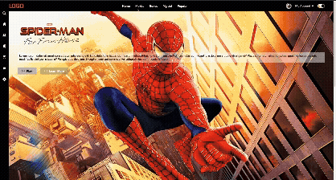

# Movie Streaming Web Interface (HTML & CSS)

A static **movie streaming web interface** built with **HTML5 and CSS3**, featuring a structured navigation system, sidebar icons, featured content area, categorized movie lists, and interactive visual styling designed to simulate a modern streaming platform layout.

## Screenshot

## Highlights
- **Top navigation bar** with menu links, user profile section, and theme toggle UI  
- **Sidebar navigation** containing quick-access action icons  
- **Featured movie section** with title image, description, and action buttons  
- **Category filter dropdown** for browsing different movie genres  
- Multiple **movie list sections** such as Popular, Trending, and New  
- **Interactive movie cards** with hover-style action icons (play, like, dislike, info)  
- Clean **layout organization** inspired by modern streaming services  

## Technologies Used
- **HTML5**
- **CSS3**
- **Bootstrap Icons** for interface visuals  

## Installation
1. Clone or download this repository  
2. Open `index.html` in your preferred web browser  

## Project Notes
- Front-end user interface only (**no backend or dynamic JavaScript functionality**)  
- Designed primarily for **layout practice and visual styling**  
- Movie images and assets are stored locally within the project directories  

## Author
**Efe Gorgulu**  
GitHub: https://github.com/efegorgulu  

## License
This project is intended for **educational and portfolio purposes only**.  
It is **not affiliated with, endorsed by, or associated with any film studio or streaming platform.**
